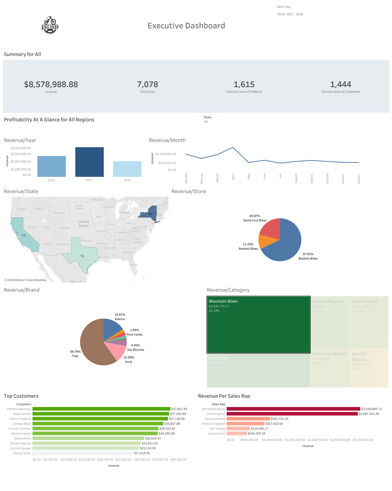

# Bike Stores Sales Analysis (2016-2018)

Analysis bike stores sales analysis from 2016-2018. Interactive Tableau dashboard can be found here ->[View Dashboard](https://public.tableau.com/views/bikestoressalesanalysisdashboard/Dashboard1?:language=en-US&:sid=&:redirect=auth&:display_count=n&:origin=viz_share_link)

---
### Similar Excel Dashboard

In addition to the Tableau dashboard, I have also created a similar dashboard in Excel that visualizes the key business metrics and segmentation. ->
[Excel Dashboard](https://1drv.ms/x/c/8218cce8877c692b/Ea32kyrIyPBEhVvRl5tuR-sBpEF4LRg7EisjcbH_2-9z9g?e=Yw5Xnc)

---

### Tableau Dashboard 

## North Star Metrics:
* Total Revenue: $8,578,988.88 - This is the overarching metric reflecting the financial success of the business.
* Total Units Sold: 7,078 - Indicates the volume of sales and product demand.
* Distinct Count of Orders: 1,615 - Shows customer engagement and order frequency.
* Distinct Count of Customers: 1,444 - Reflects the customer base size and growth potential.
Dimensions:
* Time Period: Years (2016, 2017, 2018), Months
* Geography: States (CA, NY, TX)
* Store Name: Baldwin Bikes, Rowlett Bikes, Santa Cruz Bikes
* Product Categories: Mountain Bikes, Road Bikes, Cruisers Bicycles, etc.
* Brand: Trek, Electra, Surly, etc.
* Customer Segments: Top Customers by Revenue
Sales Representatives: Revenue Per Sales Rep

## Summary of Insights

1. Total Revenue Trends:
    * The highest revenue was observed in 2017, with a significant drop in 2018.
        ○ Monthly analysis reveals a spike in revenue during certain months, particularly in April 2018, suggesting a seasonal impact on sales.
2. Revenue by State and Store:
    *  The majority of the revenue was generated in New York state, with significant contributions from Baldwin Bikes.
    * Santa Cruz Bikes and Rowlett Bikes also contributed, but to a lesser extent.
3. Revenue by Brand and Product Category:
    * Trek is the leading brand in terms of revenue, far surpassing other brands like Electra and Surly.
    * Mountain Bikes are the most popular category, followed by Road Bikes and Cruisers, indicating customer preference for specific types of bicycles.
4. Top Customers and Sales Representatives:
    * Pamela Newman, Abby Gamble, and Sharyn Hopkins are among the top customers, contributing the highest revenue.
    * Sales representatives Marcelene Boyer and Venita Daniel are the top performers, responsible for the majority of the sales.
## Key Business Metrics and Segmentation:
* Revenue Segmentation: Analysis by year, state, store, brand, product category, customer, and sales representative.
* Insights: Focus on high-revenue brands and categories, potential for expanding sales in underperforming states and stores.
* Seasonality: Identified key months with sales peaks, suggesting a need for targeted marketing strategies during these periods.

## Recommendations:
1. Investigate the Revenue Drop in 2018: A deep dive into the factors leading to the decline in 2018 revenue is essential to prevent future losses.
2. Leverage Peak Sales Months: Develop marketing campaigns and inventory strategies that align with the seasonal spikes in revenue, particularly in April.
3. Expand Successful Brands and Categories: Consider increasing the stock and promotional efforts for top-performing brands like Trek and popular categories like Mountain Bikes.
4. Focus on High-Performing Sales Reps: Analyze the strategies used by top sales representatives to replicate their success across the sales team.

